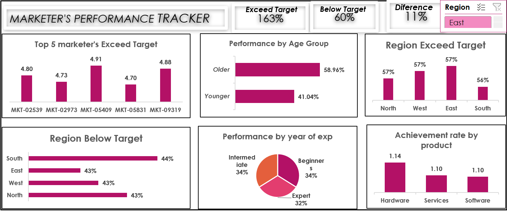

# Marketer-Performance-Tracker
##  Introduction
This project analyzes marketer performance using Excel dashboards and charts.  
It highlights trends across regions, age groups, and product categories, and provides actionable recommendations.

##  Project Description
The dataset includes marketer IDs, regions, age groups, experience years,product, actual, target and performance ratio. 
Using Excel pivot tables and charts, I built a dashboard to visualize performance metrics and identify improvement opportunities.

## Tools Used
- Microsoft Excel
  - Pivot tables for summarizing performance
  - Charts and dashboards for visualization
  - **IF statements** to create new calculated columns (e.g., flagging marketers who exceeded targets)
- Data visualization techniques

  ##  Key Insights
- **Top Performers** Certain marketers (MKT-05409, MKT-09319, MKT-02539, MKT-02973 and MKT-05831) consistently exceed targets, showing strong individual contributions.
  
**Age Group Performance** Older marketers (58.96%) outperform younger ones (41.04%), suggesting experience plays a significant role in hitting targets.

**Regional Trends** All regions are roughly the same, with about (57%), exceed-target rates but the South slightly underperforms with 44% below target.

 **Experience Level** Beginners and intermediates each make up 34% of performance, while experts contribute 32%. This balance shows that newer marketers are holding their own.
 
**Product Achievement Rates** Hardware (1.14) slightly outpaces services and software (1.10 each), indicating stronger sales or efficiency in that category.

**Overall Summary** Exceed target rate (163%) is much higher than below target (60%), showing strong overall performance, but the 11% difference highlights room for improvement.

## Recommendations
 **Leverage Top Performers**; Use high achievers as mentors or case studies to train others, especially in regions or age groups lagging behind.
 
 **Targeted Training for Younger Marketers**; Since younger marketers underperform, tailored coaching or pairing them with experienced colleagues could close the gap.
 
**Regional Strategy Adjustment**; Focus on the South region with additional support, incentives, or localized strategies to reduce below-target rates.

**Product Diversification**; While hardware leads, services and software are close behind. Explore bundling or cross-selling strategies to maximize performance across all product categories.

**Experience-Based Development**; Since beginners are performing nearly as well as experts, invest in structured career development programs to accelerate their growth.

##  Dashboard Preview

